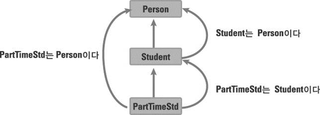

# Inheritance
- 상속시 생성의 순서와 소멸의 순서
- 생성시
  - 부모 -> 자식
- 소멸시
  - 자식 -> 부모

```cpp
#include <iostream>
using namespace std;

class Base
{
private:
	int bNum;
public:
	Base()
	{
		bNum = 0;
		cout << "Base() called." << bNum << endl;
	}
	Base(int n)
	{
		bNum = n;
		cout << "Base(int n) called." << bNum << endl;
	}
	~Base()
	{
		cout << "~Base() called." << endl;
	}
};

class Derived : public Base
{
private:
	int dNum;
public:
	Derived()
	{
		dNum = 0;
		cout << "Derived() called." << dNum << endl;
	}

	Derived(int n) : Base(n)
	//Derived(int n)
	{
		dNum = n;
		cout << "Derived(int n) called." << dNum << endl;
	}

	~Derived()
	{
		cout << "~Derived() called." << endl;
	}
};

int main(void){

	Derived drv1(1);

	return 0;
}
```

- Output
> Base(int n) called.1  
> Derived(int n) called.1  
> ~Derived() called.  
> ~Base() called.  


## 상속 시, 생성자를 호출하는 방법

```cpp
#include <iostream>
using namespace std;

class Person
{
private:
	char name[20];
	int age;
public:
	Person()
	{
		age = 0;
		strcpy(name, "noName");
	}
	Person(char * name, int age)
	{
		this->age = age;
		strcpy(this->name, name);
	}
	char * GetName(){
		return name;
	}
	int GetAge(){
		return age;
	}

	void SetName(char * name){
		strcpy(this->name, name);
	}
	void SetAge(int age){
		this->age = age;
	}
};

// 상속 시키는 방법 ": public Person"
class Student : public Person
{
private:
	char major[30];
public:
	Student()
	{}

	// 기반 클래스는 기반클래스의 생성을 책임지고
	// 파생 클래스는 파생클래스의 생성을 책임져야 한다.
	Student(char * name, int age, char * major)
		// 방법 1. 부모 생성자를 명시적으로 호출.
		// 흐름 : 부모생성자 호출 -> 자식 클래스 생성자 호출.
		: Person(name, age)
	{
		// 방법2
		//SetName(name);
		//SetAge(age);

		// 방법3
		// 부모 클래스의 메소드를 호출.
		//__super::SetName(name);
		//__super::SetAge(age);
		strcpy(this->major, major);
	}
	void ShowData(){
		cout << "이름 : " << GetName() << endl;
		cout << "나이 : " << GetAge() << endl;
		cout << "전공 : " << major << endl;
	}
};

int main(void){

	Student s1("kim", 23, "computer science");
	s1.ShowData();

	Student s2;
	s2.ShowData();
	return 0;
}
```


## Protected
- 상속 관계에 놓여있을 경우 접근을 허용하게 하는 키워드이다.
  - **상속관계에 있는 클래스에서는 public처럼 사용이 가능하다.**
- 그 이외는 private 멤버와 동일.
  - **즉, 상속받은 클래스 외부에서 접근은 불가능하다.**


- [전체 코드](./CH_22/Inherit_Protected.cpp)

```cpp
class Person
{
// 기본은 private과 동일하게 동작한다.
// protected의 기능은 상속관계에서 파악해야 한다.
protected:
	char name[20];
	int age;
  ...
};

class Student : public Person
{
...
	void ShowData(){
		// private선언시 name과 age는 접근이 불가능 했으나,
		// protected로 만들시 , name과 age는 직접 접근이 가능하다.
		cout << "이름 : " << name << endl;
		cout << "나이 : " << age << endl;
		cout << "전공 : " << major << endl;
	}
};
```
- 접근 지정자에 따른 멤버 접근 여부.
  - 상속된 클래스에서 가능한 접근 지정자는?
  - 클래스 외부에서 접근 가능한 지정자는?

```cpp
#include <iostream>
using namespace std;

class Base
{
private:
	int priNum;
protected:
	int proNum;
public:
	int puNum;
};

class Derived : public Base
{
	void ShowData(){
		cout << priNum << endl;  // error
		cout << proNum << endl;
		cout << puNum << endl;
	}
};

int main(void){

	Derived d1;
	cout << d1.priNum << endl;  // error
	cout << d1.proNum << endl;  // error
	cout << d1.puNum << endl;

	return 0;
}
```


## Has-A  Is-A
- Has-a 관계 : A 가 B 를 가지고(포함하고) 있는 관계
  - 예) 자동차는 타이어를 가지고 있다.
- Is-a 관계 : A 가 B 인 관계
  - 예) 사과는 과일이다., ~은 ~이다

- **Has-a 관계의 경우에는 포함을 사용한다.**
- **Is-a 관계의 경우에는 상속을 사용한다.**

- 객체들을 모델링 할 때, Has-a 관계인지 Is-a 관계인지를 생각하면, 모델링이 조금 더 수월할 수도 있다.
- Has-A 관계라면, 어떠한 클래스가 자신의 멤버로 다른 클래스를 가지고 있는 관계를 뜻한다.

- Has-A와 Is-A의 경계는 명확하지 않다.

## Static-Binding VS Dynamic Binding(Has-A)
- 다음과 같은 관계가 있다고 해보자.
- [원본 코드](./CH_22/CarClass_HasA.cpp)

- **Static-Binding**

```cpp
class Engine{ ... };

class Car
{
private:
  // static binding
	Engine engine;
};
```

- **Dynamic-Binding**

```cpp
class Engine{ ... };
class Car
{
private:
	Engine * engine;
public:
	Car{
    // dynamic binding
		engine = new Engine;
	}
};
```


## 객체 포인터(Object Pointer)
- 객체의 주소 값을 저장할 수 있는 포인터



- AAA 클래스의 포인터는 AAA 객체 뿐만 아니라, AAA 클래스를 상속하는 Derived 클래스 객체의 주소 값도 저장 가능
- 포인터를 통해서 접근할 수 있는 객체 멤버의 영역.
- **AAA 클래스의 객체 포인터는 가리키는 대상에 상관없이 AAA 클래스 내에 선언된 멤버에만 접근**

### Upcasting
- Upcasting이 왜 필요하게 되는것일까?
- [원본 코드2](./CH_22/Is_A_Pointer1.cpp)
- [원본 코드2](./CH_22/Is_A_Pointer2.cpp)

```cpp
class Person{
public:
	void Sleep() {cout << "Sleep()" << endl;}
};

class Student : public Person{
public:
	void Study(){cout << "Study()" << endl;}
};

class PartTimeStd : public Student{
public:
	void Work(){cout << "Work()" << endl;}
};
// Upcasting
// 객체 포인터의 권한은 가리키는 대상(PartTimeStd)과 상관없이
// 할당받은 객체의(s1) 멤버에만 접근 가능하다.
Student * s1 = new PartTimeStd();
s1->Sleep();
s1->Study();
```

### Object Reference(객체 레퍼런스)
- 객체 포인터와 마찬가지로, 권한이 달라진다.
- [원본 코드](./CH_22/Is_A_Pointer_Reference.cpp)

```cpp
class Person{
public:
	void Sleep() { cout << "Sleep()" << endl; }
};

class Student : public Person{
public:
	void Study(){ cout << "Study()" << endl; }
};

class PartTimeStd : public Student{
public:
	void Work(){ cout << "Work()" << endl; }
};

PartTimeStd pt;
Student & ref1 = pt;
Person & ref2 = pt;

pt.Sleep(); pt.Study(); pt.Work();
cout << "===========================" << endl;

ref1.Sleep(); ref1.Study();
cout << "===========================" << endl;

ref2.Sleep();
// error
// ref2.Work();
```

### Downcasting 이라는 개념은 없다.
- 기반 클래스의 포인터는 파생클래스의 오브젝트의 주소를 저장할 수 있다. 그러나 파생클래스의 포인터는 기반클래스의 오브젝트 주소를 저장할 수 없다.
- 기반클래스의 포인터가 파생클래스의 오브젝트를 가리킬 때 그 포인터를 통해 멤버함수를 호출하면 기반클래스로  부터 상속받은 멤버나, 멤버함수만 호출할 수 있다.

```cpp
// error
// Downcasting
Student * s2 = new Person();
```
