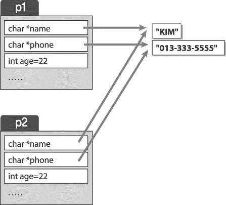
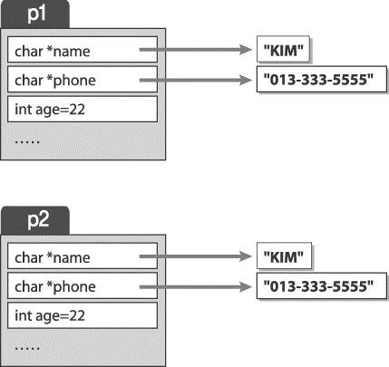

# OOP
## 접근 제어 지정자(Access Modifier)
- public
- private
- protected
- getter/setter를 통해서 멤버 변수 접근, 및 수정.

## Constructor(생성자)
- 객체 생성 시 반드시 한번 호출되는 함수.
- 클래스와 같은 이름의 함수다.
- 리턴형이 없으며 리턴 하지도 않는다.
- 생성자를 호출하는 여러가지 방법.

```cpp
class Point{
private:
	int x, y;
public:
	Point(int _x=0, int _y=0);
	~Point();
	void ShowData();
};

Point p1;
Point p2(100,200);
Point p3 = Point(50, 60);
Point p4(); // 객체 생성이 아님. 함수의 원형으로 이해한다.
Point p5(300); // default argument가 지정되어 있을때에만 가능한 생성방식.
```

## Default 복사 생성자
- class를 만들어서 사용할 때 제공되는 기본 복사 생성자는 인수로 자신과 동일한 형의 변수를 인수로 받는다.
- 자신과 같은 클래스형의 레퍼런스를 인자로 갖는 생성자이다.
- 복사 생성자는 오브젝트를 새 오브젝트에 복사한다.
- 복사 생성자는  오브젝트가 초기화될 때 호출된다 (복사생성자는 반드시 참조형으로 받아야 한다)
- 사용자 정의 복사  생성자가 없을 때 자동 삽입
- 멤버 변수 대 멤버 변수의 복사를 수행한다.
- **Default 복사 생성자**의 복사 형태는 Shallow Copy이다.

<p align="center">
  
</p>


- **Default 복사 생성자**는 다음과 같은 문제점이 있다.
  - 멤버중 동적할당을 받는 멤버가 있는 경우, 멤버 대 멤버로 복사하므로,  복사 받은 개체가 먼저 소멸시 할당된 Heap영역을 해제한다.
  - 이후 원본 개체가 소멸시 해제된 영역을 또 해제 하므로 문제가 발생한다.
  - 이러한 문제를 해결하기 위해서 Deep copy를 수행해야 한다.



- 다음은 Deep Copy를 보여주는 코드이다.

```cpp
#define _CRT_SECURE_NO_WARNINGS
#include <iostream>
#include <cstring>
using namespace std;


class Person
{
private:
	// char name[SIZE]의 장점은 프로그램이 쉽다.
	// 하지만 overflow로 메모리 침범의 위험이 있다. (프로그램의 잠재적 위협 초래)
	// 따라서 포인터 변수로 바꾼다.
	char *name;
	char *phone;
	int age;
public:
	Person();
	Person(char *, char *, int);
	Person(Person & ref);
	void ShowData();
	~Person();
};

void Person::ShowData(){
	cout << name << "," << phone << "," << age << endl;
}

Person::Person(){
	strcpy(name, "No Name");
	strcpy(phone, "No Phone");
	age = 0;
}
Person::Person(char * _name, char * _phone, int _age){
	// 힙에 생성된 문자열의 주소를 연결시킨다.
	//name = _name;  // 이런식으로 하면 안된다. 객체에 들어갈 정보는 의존성이 없어야 한다.

	// heap에 생성된 p1 메모리의 공간에 데이터를 채워줘야 한다.
	name = new char[strlen(_name) + 1];
	strcpy(name, _name);
	phone = new char[strlen(_phone) + 1];
	strcpy(phone, _phone);
	age = _age;
}
Person::Person(Person & ref){
	// deepcopy
	name = new char[strlen(ref.name) + 1];
	strcpy(name, ref.name);
	phone = new char[strlen(ref.phone) + 1];
	strcpy(phone, ref.phone);
	age = ref.age;
}
Person::~Person(){
	// 소멸자에서는 생성자에서 heap에 생성한 문자열을 회수해야 한다.
	// 문자열을 회수하지 못하면, memory leak이 발생한다.
	cout << "Person " << name << " instance destroyed." << endl;
	delete[] name;
	delete[] phone;
}
int main(void){

	Person p1 = Person("kai", "010-2323-3030", 38);
	p1.ShowData();

	Person p2(p1);
	// 사용자 정의 복사 생성자를 정의하지 않으면,
	// 실행시 프로그램이 죽는다.
	// 그 이유는, p1객체가 삭제되면서 p1의 멤버가
	// 참조하고 있던 name, phone이 소멸되는데, p2가 같은 멤버 변수를 삭제하려고 했을 때
	// 이미 소멸되어 있기 때문에, 소멸시킬 대상이 없다.
	// 따라서 이 경우 crash가 난다.
	p2.ShowData();

	// 사용자 정의 복사 생성자가 없는 경우, 객체를 복사할 때 Shallow Copy라고 한다.
	// 사용자 정의 복사 생성자가 있는 경우, 객체를 복사할 때 Deep copy를 한다.(관례)
	return 0;
}
```

- 다음은 복사 생성자의 호출 형태를 보여주는 코드이다.

```cpp
// Copy_Constructor.cpp
#include <iostream>
using namespace std;

class SoSimple{
private:
	int salary;
public:
	SoSimple(int _sal){
		cout << "SoSimple(int _sal) called." << endl;
		salary = _sal;
	}
	SoSimple(SoSimple & ref){
		cout << "SoSimple(SoSimple & ref) called." << endl;
		salary = ref.salary;
	}
	SoSimple& ShowData(){
		cout << "salary : " << salary << endl;
		return *this;
	}
	void Simple1(SoSimple tmp){
		// tmp변수에 복사생성자로 obj2의 내용이 복사된다.
		cout << "개체를 인자로 전달 : " << tmp.salary << endl;
	}
	SoSimple Simple2(){
		cout << "개체를 반환!!" << endl;
		SoSimple tmp(350000);
		return tmp;
	}

	SoSimple & AddSudang(int sudang){
		salary += sudang;
		return *this;
	}

};

int main(void){

	SoSimple obj1(2700000);
	// Case 1
	// 기존에 생성된 객체로 새로운 객체 초기화
	SoSimple obj2(obj1);
	obj2.ShowData();

	cout << "============\n" << endl;

	// Case 2
	// 함수 호출 시 객체를 값에 의해 전달
	// 함수의 인자로 전달될 시, 복사되면서 객체가 새로 생성된다.
	// 그 증거로 "SoSimple(SoSimple & ref) called."가 찍히는 것을 볼 수 있다.
	obj1.Simple1(obj2);

	cout << "============\n" << endl;

	// Case 3
	// 함수 내에서 객체를 값에 의해 리턴
	// 이 또한 마찬가지로, 함수가 호출된 후 스택프레임이 제거되면서
	// 리턴값으로 객체가 새로 생긴다.
	// 지금 같은 경우, 함수 내부에서 사용자 정의 생성자를 통해서
	// 인스턴스가 하나 생성되고,
	// 그 인스턴스를 복사해서 리턴값으로 반환하면서 인스턴스가 하나 더 생겼다.
	// tmp인스턴스의 내용이 복사생성자를 통해서 복사되어서 obj3에 할당된다.
	SoSimple obj3 = obj1.Simple2();

	obj3.ShowData();

	cout << "============\n" << endl;
	// Method chaining
	obj1.AddSudang(200000).ShowData();

	return 0;
}
```

## Destructor(소멸자)
- delete, delete[] 명령어를 통해서 객체를 소멸시킬때 호출되는 메소드이다.
- 소멸자의 정의는 클래스 이름앞에 **~** 를 붙인다.
- 아래 예제는 AAA가 생성된 후, 소멸될때의 결과를 보여주는 함수이다.
- 스택에 생성된 객체는 프로그램종료와 함께 소멸된다.
  - 즉, 프로그램이 종료하기 전에, 스택에 생성된 객체의 소멸자를 호출한다는 뜻이다.
- 하지만, 힙 공간에 생성한 객체는 소멸되지 않는다.
  - 이 말은, 프로그램이 종료한다고 하더라도, 힙공간에 생성된 객체는 소멸되지 않는다는 뜻이다.

```cpp
#include <iostream>
using namespace std;

class AAA{
public:
	AAA(){
		cout << "AAA() 호출." << endl;
	}
	~AAA(){ // 사용예 메모리 반납, 파일 시스템 연결종료, 네트워크에 대한 정리.
		cout << "~AAA() 호출." << endl;
	}
};

int main(void){
	AAA a1;
	AAA a2;
  AAA * a3 = new AAA();

	return 0;
}
```

## Converting Constructor(변환 생성자)
- explicit
- 생성자에 해당 키워드가 붙으면, C 스타일로 생성이 불가하다.

```cpp
#include <iostream>
using namespace std;

class AAA
{
private:
	int val;
public:
	explicit AAA(int _val){
		val = _val;
	}
	void ShowData(){
		cout << "val : " << val << endl;
	}
};

int main(void){

	int val1 = 10; // C 스타일 초기화
	int val2(20);  // C++ 스타일 초기화, 기본형 모두 class overloading이 되어 있다.

	cout << val1 << "," << val2 << endl;

	AAA a1(100);
	a1.ShowData();

	// C 스타일로 초기화를 하더라도,
	// 암시적으로 C++ 스타일로 초기화가 된다.
	// AAA a2(200);
	// 하지만, explicit 키워드를 생성자에 적으면, 암시적 변환이 되지 않는다.
	// explicit 사용시 아래 코드는 에러가 난다.
	AAA a2 = 200;
	//a2.ShowData();

	return 0;
}
```

## Abstract Class(ABC, 추상화 클래스)
  - C++에서는 클래스의 명세만을 적어놓은 클래스가 존재한다.
  - 이는 마치, java의 interface와 비슷하다.
  - C++에서는 멤버와 함수의 원형만 정의한다.
  - 함수의 구현은 분리해서 구현한다.

- 아래 코드는 ABC의 예이다.

```cpp
class Person{
private:
	char name[SIZE];
	char phone[SIZE];
	int age;
public:
	Person();
	void ShowData();
	void SetData(char * _name, char * _phone, int _age);
	void SetName(char * _name);
	void SetPhone(char * _phone);
	void SetAge(int _age);
	~Person();
};
```

- 아래 코드는 Person 클래스의 메소드의 구현체이다.

```cpp
void Person::SetName(char * _name){
	strcpy(name, _name);
}
void Person::SetPhone(char * _phone){
	strcpy(phone, _phone);
}
void Person::SetAge(int _age){
	age = _age;
}
void Person::SetData(char * _name, char * _phone, int _age){
	SetName(_name);
	SetPhone(_phone);
	SetAge(_age);
}
void Person::ShowData(){
	cout << name << "," << phone << "," << age << endl;
}
Person::~Person(){
	cout << "Person instance destroyed." << endl;
}
Person::Person(){

}
```
