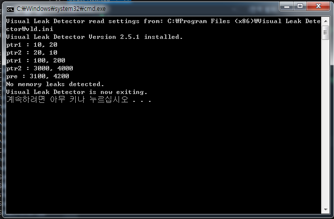
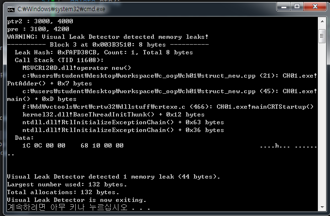

# Visual Leak Detector 사용법
- VLD 설치 후.
- Program Files(x86)에 있는 **Visual Leak Detector** 파일을 찾아간 후,
**bin, include, lib** 폴더에 있는 내용을 **사용중인 Microsoft Visual Studio**  
의 **VC 폴더 에 있는 bin, include, lib** 폴더에 복사해서 붙여넣는다.
- 그 후, **include** 폴더에 들어가 있는 **vld.h** 의 경로를 붙여서 디버깅 하고자 하는
파일에 **include** 시킨다.
- 다음은 코드에 붙여놓은 경로이다.

```cpp
#include <C:\Program Files (x86)\Microsoft Visual Studio 12.0\VC\include\vld.h>
```

- 다음은 메모리 누수가 생기지 않은 코드의 결과이다.


- 다음은 메모리 누수가 생긴 코드의 결과이다.

